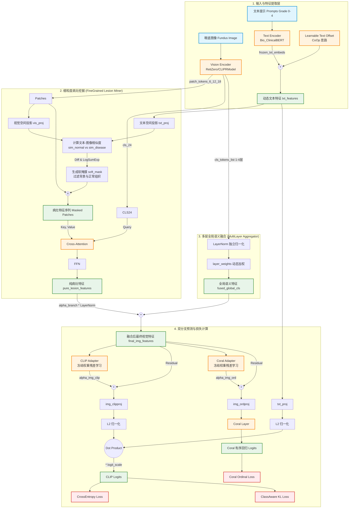

# 模型架构图

```mermaid
graph TD
    %% 样式定义
    classDef inputNode fill:#e1f5fe,stroke:#0288d1,stroke-width:2px;
    classDef modelNode fill:#fff3e0,stroke:#f57c00,stroke-width:2px;
    classDef featureNode fill:#e8f5e9,stroke:#388e3c,stroke-width:2px;
    classDef lossNode fill:#ffebee,stroke:#d32f2f,stroke-width:2px;

    %% ---------------- 输入与主干网络 ----------------
    subgraph Inputs ["1. 输入与特征提取层"]
        Img_In[眼底图像 Fundus Image]:::inputNode
        Txt_In[文本提示 Prompts Grade 0-4]:::inputNode
        
        VE[Vision Encoder<br/>RetiZero/CLIPRModel]:::modelNode
        TE[Text Encoder<br/>Bio_ClinicalBERT]:::modelNode
        
        Img_In --> VE
        Txt_In --> TE
        
        TE -->|frozen_txt_embeds| Txt_Add((+))
        Learn_Offset[Learnable Text Offset<br/>CoOp 思路]:::modelNode --> Txt_Add
        Txt_Add --> Txt_Feat[动态文本特征 txt_features]:::featureNode
    end

    %% ---------------- 病灶挖掘分支 ----------------
    subgraph Miner ["2. 细粒度病灶挖掘 (FineGrained Lesion Miner)"]
        VE -->|patch_tokens_6_12_18| Patches
        VE -->|cls_24| CLS24
        
        Patches --> Vis_Proj[视觉空间投影 vis_proj]
        Txt_Feat --> Txt_Proj[文本空间投影 txt_proj]
        
        Vis_Proj --> Sim_Calc[计算文本-图像相似度<br/>sim_normal vs sim_disease]
        Txt_Proj --> Sim_Calc
        
        Sim_Calc -->|Diff & LogSumExp| SoftMask[生成软掩膜 soft_mask<br/>过滤背景与正常组织]
        Patches --> Mask_Multiply((x))
        SoftMask --> Mask_Multiply
        Mask_Multiply --> Masked_Patches[病灶特征序列 Masked Patches]:::featureNode
        
        CLS24 -->|Query| CrossAttn[Cross-Attention]:::modelNode
        Masked_Patches -->|Key, Value| CrossAttn
        CrossAttn --> FFN[FFN] --> Pure_Lesion[纯病灶特征 pure_lesion_features]:::featureNode
    end

    %% ---------------- 多层全局特征融合 ----------------
    subgraph Global ["3. 多层全局语义融合 (MultiLayer Aggregator)"]
        VE -->|cls_tokens_list 1-4层| MultiNorm[LayerNorm 独立归一化]
        MultiNorm --> LayerWeights[layer_weights 动态加权]
        LayerWeights --> Fused_Global[全局语义特征 fused_global_cls]:::featureNode
    end

    %% ---------------- 特征汇聚 ----------------
    Fused_Global --> Final_Fusion((+))
    Pure_Lesion -->|alpha_branch * LayerNorm| Final_Fusion
    Final_Fusion --> Final_Feat[融合后最终视觉特征 final_img_features]:::featureNode

    %% ---------------- 双分支输出层 ----------------
    subgraph Dual_Branch ["4. 双分支预测与损失计算"]
        %% 分支 A：CLIP 图文对比
        Final_Feat --> CLIP_Adapter[CLIP Adapter<br/>冻结权重残差学习]:::modelNode
        Final_Feat -->|Residual| CLIP_Add((+))
        CLIP_Adapter -->|alpha_img_clip| CLIP_Add
        CLIP_Add --> Img_Clip_Proj[img_clipproj]
        Img_Clip_Proj --> L2_Norm1[L2 归一化]
        
        Txt_Feat --> Txt_Base_Proj[txt_proj]
        Txt_Base_Proj --> L2_Norm2[L2 归一化]
        
        L2_Norm1 --> DotProduct((Dot Product))
        L2_Norm2 --> DotProduct
        DotProduct -->|* logit_scale| CLIP_Logits[CLIP Logits]:::featureNode
        
        %% 分支 B：Coral 有序回归
        Final_Feat --> Coral_Adapter[Coral Adapter<br/>冻结权重残差学习]:::modelNode
        Final_Feat -->|Residual| Coral_Add((+))
        Coral_Adapter -->|alpha_img_ord| Coral_Add
        Coral_Add --> Img_Ord_Proj[img_ordproj]
        Img_Ord_Proj --> Coral_Layer[Coral Layer]:::modelNode
        Coral_Layer --> Coral_Logits[Coral 有序回归 Logits]:::featureNode
        
        %% 损失
        CLIP_Logits --> Loss_CE[CrossEntropy Loss]:::lossNode
        CLIP_Logits --> Loss_KL[ClassAware KL Loss]:::lossNode
        Coral_Logits --> Loss_Coral[Coral Ordinal Loss]:::lossNode
    end
```
